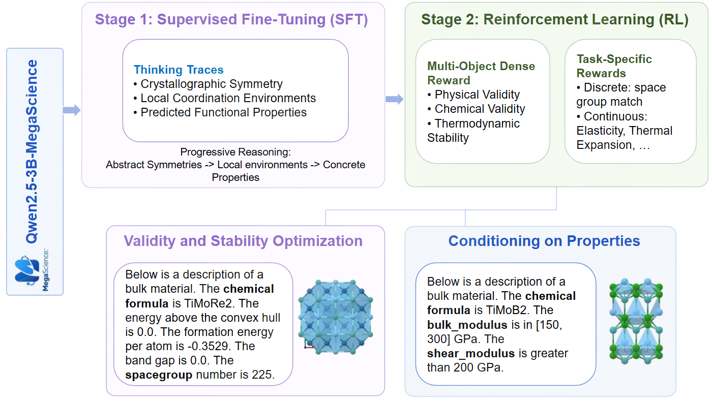

<div align="center">
<h1>CrystalReasoner: Reasoning and RL for Property-Conditioned Crystal Structure Generation<br>
</h1>
</div>

CrystalReasoner (CrysReas) is an end-to-end LLM framework for generating crystal structures from natural language instructions. It uses supervised fine-tuning (SFT) to teach crystal-structure generation, thinking traces to introduce crystallographic and physical priors before coordinates, and reinforcement learning (RL) with verifiable rewards to improve validity, stability, and property conditioning. Please see our work at [crystalreasoner.github.io](https://crystalreasoner.github.io/).

<h4 align="center">
  
[](https://github.com/wyy603/CrystalReasoner/)
[](https://crystalreasoner.github.io/)
[](https://huggingface.co/CrystalReasoner)
[](https://arxiv.org/abs/2605.14344)
</h4>



## Resources

| Model Name | Notes |
| --- | --- |
| [🤗 Qwen2.5-3B-CrysReas](https://huggingface.co/CrystalReasoner/Qwen2.5-3B-CrysReas) | Our model with both SFT and RL optimization. |
| [🤗 Qwen2.5-3B-CrysReas-SpaceGroup](https://huggingface.co/CrystalReasoner/Qwen2.5-3B-CrysReas-SpaceGroup) | Space-group property specialist. |
| [🤗 Qwen2.5-3B-CrysReas-ElasticProperties](https://huggingface.co/CrystalReasoner/Qwen2.5-3B-CrysReas-ElasticProperties) | Elastic-property specialist. |
| [🤗 Qwen2.5-3B-CrysReas-ThermalExpansion](https://huggingface.co/CrystalReasoner/Qwen2.5-3B-CrysReas-ThermalExpansion) | Thermal-expansion specialist. |

The first model is our main model. The subsequent models were optimized for property conditioning. See usage in the huggingface pages.

## Installation

### Python Environment

The easiest way to install prerequisites is via [uv](https://github.com/astral-sh/uv), a fast Python package and project manager.

Assumes you are running Linux and have a CUDA GPU. The CrysReas environment can be installed via the following command. Notably, the torch version will be 2.8.0+cu128 because of Verl, and we adjust other modules to fit its torch version.

```bash
# Better for building
export MAX_JOBS=8

# Initialize the environment
uv venv .venv --python 3.12
source .venv/bin/activate

# Basics
uv pip install pip
uv pip install -e .
uv pip install -r requirements.txt
uv pip install ninja

# Install Verl
bash submodules/verl/scripts/install_vllm_sglang_mcore.sh

# Install torch-sim
uv pip install -e "submodules/torch-sim[mace,test]"

# Install mattergen
uv pip install torch-cluster -f https://data.pyg.org/whl/torch-2.8.0+cu128.html
uv pip install torch-scatter -f https://data.pyg.org/whl/torch-2.8.0+cu128.html
uv pip install torch-sparse -f https://data.pyg.org/whl/torch-2.8.0+cu128.html
uv pip install -e submodules/mattergen

# Some fix, you may not need them? But if you encounter problems, try to use them.
uv pip install e3nn==0.4.4
uv pip install mattersim==1.2.0
uv pip install "numpy<2.2"
uv pip install "ase==3.25.0"
uv pip install -U mp-api emmet-core
uv pip install pymatgen==2024.10.29
```

Optionally, you can install apex for better training and inference.

```bash
# Clone apex somewhere and install.
export FORCE_CUDA=1
git clone https://github.com/NVIDIA/apex.git
cd apex
APEX_CPP_EXT=1 APEX_CUDA_EXT=1 pip install -v --no-build-isolation .
```

### Dataset Preparation

We constructed a shelve database from Materials Project under `assets/MP/` which is not in the github repo. To generate it, please follow the instructions below.

1. Set the environment variable `MP_API_KEY` (api key of Materials Project). Notably, you can write `.env` file in the project folder to do this.

2. Download the Materials Project shelve database:

```bash
python -m crysreas.data.download --args.download_type summary --args.add_new
python -m crysreas.data.download --args.download_type robocrys
```

3. Insert MLIP-calculated properties (elasticity, thermal expansion) as ground truth:

```bash
python -m crysreas.data.mlip.insert_properties
```

See [`doc/DATASET.md`](doc/DATASET.md) to understand how the physical properties are calculated, and how the split files for different experiments are generated (as these files are already in github repo, it's optional for you to reproduce them). See [`doc/METRICS.md`](doc/METRICS.md) for the metric names and required inputs.

### MP2020Correction

MatterGen's MP2020 correction file is also required for energy-above-hull evaluation:

```bash
curl -L -o submodules/mattergen/data-release/alex-mp/reference_MP2020correction.gz \
  https://github.com/microsoft/mattergen/raw/main/data-release/alex-mp/reference_MP2020correction.gz
```

## Training, Generation, and Validation

[`scripts/run.py`](scripts/run.py) is the main entrypoint. It reads experiment definitions from [`scripts/config.py`](scripts/config.py).

```bash
python scripts/run.py <experiment> [extra overrides...]
```

It supports SFT, RL/GRPO, generation, checkpoint merge, and evaluating metrics through one registry.

Before training, you must set environment variables `SWANLAB_API_KEY` and `HF_TOKEN`. Notably, you can write `.env` file in the project folder to do this.

Note that the output of this script is located in the `logs/` folder and will not be printed directly to the command line.

Common examples:

```bash
# Supervised fine-tuning baselines
python scripts/run.py sft_no_thinking
python scripts/run.py sft_thinking

# Merge FSDP checkpoints into Hugging Face format
python scripts/run.py merge \
  --path checkpoints/thinking/global_step_1514 \
  --output-path checkpoints_merged/thinking

# Generate samples from a merged checkpoint
python scripts/run.py generate checkpoints_merged/thinking

# RL/GRPO alignment from a merged SFT checkpoint
python scripts/run.py rl_thinking_novel

# Run metric_process through the unified runner
python scripts/run.py run_metric \
  --path checkpoints_merged/thinking/conditional+thinking.parquet \
  --metrics-name composition_consistency spacegroup_consistency stable_unique_novel \
  --prompt-type conditional+thinking \
  --forced
```

Representative registered jobs include:

- SFT: `sft_no_thinking`, `sft_thinking`, `sft_crystaltextllm`, `sft_crystaltextllm_8`, `sft_plaid_wyckoff`, `sft_plaid_wyckoff_8`
- RL/GRPO: `rl_no_thinking`, `rl_thinking`, `rl_thinking_novel`, `rl_spacegroup_thinking`, `rl_elastic_thinking_new`, `rl_cte_thinking`
- Generation: `generate`, `generate_rl`, `generate_elastic`, `generate_cte`, `generate_crystaltextllm`, `generate_plaid_wyckoff`
- Metrics: `run_metric`, `metric_qha`, `metric_elastic`
- Checkpoint conversion: `merge`

See [`doc/TRAINING.md`](doc/TRAINING.md) for training details.

## Metrics

The preferred evaluation path is `crysreas.metric_process`. `python scripts/run.py run_metric ` is a copy of this command. It is a DataFrame-based pipeline with named metrics, cache-like `ensure_*` helpers, optional multiprocessing for CPU metrics, and serialization helpers for Parquet files containing structures.

Example:

```bash
python -m crysreas.metric_process \
  --path checkpoints_merged/thinking/conditional+thinking.parquet \
  --metrics-name simple_structure structure_validity smact_validity composition_consistency spacegroup_consistency stable_unique_novel \
  --prompt-type conditional+thinking \
  --num-workers 1 \
  --forced
```

Important metric groups include:

- Parsing and validity: `simple_structure`, `structure_validity`, `smact_validity`
- Ground-truth consistency: `gt`, `composition_consistency`, `spacegroup_consistency`
- Relaxation and stability: `relaxed_structures`, `energy_above_hull`, `stable_unique_novel`
- Property rewards: `energy_reward`, `smooth_energy_reward`, `elastic_reward`, `elastic_reward_all`
- Property calculations: `fmax`, `elastic_properties`, `cte`

Use [`doc/METRICS.md`](doc/METRICS.md) as the source of truth for available metrics, column dependencies, prompt-type configuration, multiprocessing behavior, and Parquet structure serialization.

## Checkpoints and Results

After training, the checkpoint is genreated in `checkpoints/`. After merging, it is in `checkpoints_merged/`.

Precomputed experiment checkpoints are available at huggingface, will the sample outputs are available in the `checkpoints_merged` folder of this repo. Below is the relation between the parquets in `checkpoints_merged` folder and the huggingface models:

| Folder name in `checkpoints_merged` | Model Name | Notes |
| --- | --- | --- |
| `no_thinking` | [🤗 Qwen2.5-3B-CrysReas-Base](https://huggingface.co/CrystalReasoner/Qwen2.5-3B-CrysReas-Base) | SFT baseline without thinking traces. |
| `thinking` | [🤗 Qwen2.5-3B-CrysReas-Thinking](https://huggingface.co/CrystalReasoner/Qwen2.5-3B-CrysReas-Thinking) | SFT baseline with thinking traces. |
| `rl_no_thinking` | [🤗 Qwen2.5-3B-CrysReas-RL](https://huggingface.co/CrystalReasoner/Qwen2.5-3B-CrysReas-RL) | RL from the no-thinking baseline. |
| `rl_thinking_mix` | [🤗 Qwen2.5-3B-CrysReas](https://huggingface.co/CrystalReasoner/Qwen2.5-3B-CrysReas) | Our model with both SFT and RL optimization. |
| `thinking_only_validity` | [🤗 Qwen2.5-3B-CrysReas-NoEnergyTerm](https://huggingface.co/CrystalReasoner/Qwen2.5-3B-CrysReas-NoEnergyTerm) | Validity-focused ablation (no energy term). |
| `thinking_only_energy` | [🤗 Qwen2.5-3B-CrysReas-NoValidityTerm](https://huggingface.co/CrystalReasoner/Qwen2.5-3B-CrysReas-NoValidityTerm) | Energy-focused ablation (no validity term). |
| `spacegroup_thinking` | [🤗 Qwen2.5-3B-CrysReas-SpaceGroup](https://huggingface.co/CrystalReasoner/Qwen2.5-3B-CrysReas-SpaceGroup) | Space-group property specialist. |
| `rl_elastic_thinking_new` | [🤗 Qwen2.5-3B-CrysReas-ElasticProperties](https://huggingface.co/CrystalReasoner/Qwen2.5-3B-CrysReas-ElasticProperties) | Elastic-property specialist. |
| `rl_cte_thinking` | [🤗 Qwen2.5-3B-CrysReas-ThermalExpansion](https://huggingface.co/CrystalReasoner/Qwen2.5-3B-CrysReas-ThermalExpansion) | Thermal-expansion specialist. |
| `crystaltextllm` | [🤗 Qwen2.5-3B-CrysReas-CrystalTextLLM](https://huggingface.co/CrystalReasoner/Qwen2.5-3B-CrysReas-CrystalTextLLM) | Prior-work text format reimplementation. |
| `plaid_wyckoff` | [🤗 Qwen2.5-3B-CrysReas-PLaIDWyckoff](https://huggingface.co/CrystalReasoner/Qwen2.5-3B-CrysReas-PLaIDWyckoff) | Prior-work Wyckoff representation reimplementation. |

See more in [`doc/CHECKPOINTS.md`](doc/CHECKPOINTS.md).

## Hardware Notes

The default configuration assumes:

- At least 1 GPU for SFT.
- At least 2 GPUs for RL/GRPO jobs.
- At least 1 GPU for MLIP-backed reward or metric calculations.
- At least 4 CPUs cores for typical training and evaluation jobs.

Some registered jobs request more CPU memory and CPU cores in [`scripts/config.py`](scripts/config.py), especially elastic and CTE tasks.

## Citation

If you find our work useful, please cite:

```
@article{wu2026crysreas,
  title={CrystalReasoner: Reasoning and RL for Property-Conditioned Crystal Structure Generation},
  author={Yuyang Wu and Stefano Falletta and Delia McGrath and Sherry Yang},
  year={2026},
  journal={arXiv preprint arXiv:2605.14344},
  url={https://arxiv.org/abs/2605.14344}
}
```